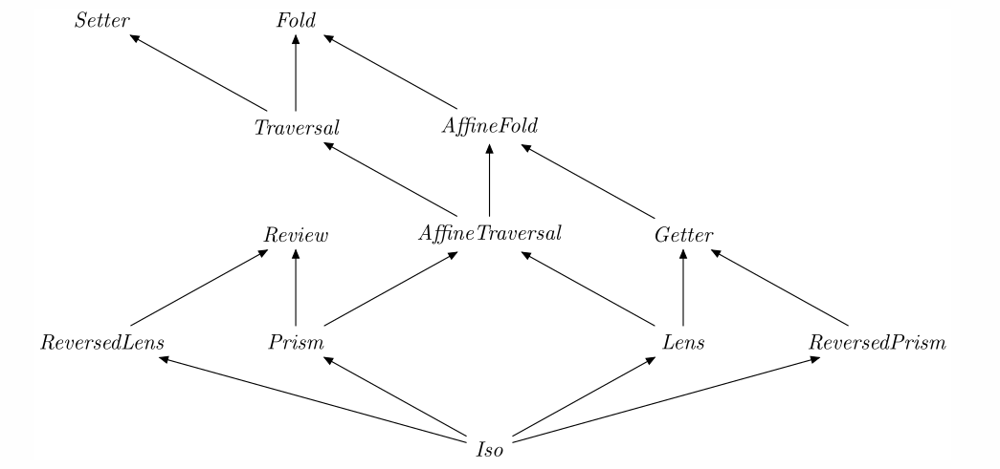

# Lens and Prism (maybe)

with Joe from Developer

----

# Look at the following code

```scala
case class Street ( number: Int, name: String );
case class Address ( street: Street, city: String );

val myAddress = Address(Street(123, "Test Road"), "Realtown")
```

How are we going to update the street name ?

----

# One way to do it to use copy

```scala
val myNewAddress = myAddress.copy(
    street = (myAddress.street.copy(
        name = "Copied Road")
    )
)
```
----

# Let's try it in the code

Hopefully you memorise the implementation just now from the slide

---

# Is there anything wrong with it?

Nope, it's easy to understand and it's not mutating the data

----

# George Wilson touched on this topic


----

# Some of you might or might not have asked

What if it is deeply nested?

Is there a more composable way of doing this?

----

# Let's have a look at lens

It's a set of function to interact with a subpart of some data type

```scala
case class Lens[S, A] (
    get: S => A,
    set: (S, A) => S
)
```

-----

# In our address example we can create the lenses like so

```scala
val streetNameLens = Lens[Street, String] (
    get = (s: Street) => s.name,
    set = (s: Street, n: String) => s.copy(name = n)
)

val addressStreetLens = Lens[Address, Street] (
    get = (a: Address) => a.street,
    set = (a: Address, s: Street ) => a.copy(street = s)
)
```

----

# Let's try it in the playground

----

# Lenses can compose

$Lens[A,B] \circ  Lens[B,C] = Lens[A,C]$


```scala
def composeLens[A,B,C](ab: Lens[A,B], bc: Lens[B,C]): Lens[A,C] = {
    return Lens[A,C](
        get = (a: A) => bc.get(ab.get(a)),
        set = (a: A, c: C) => ab.set(a, bc.set(ab.get(a), c))
    )
}
```

----

# Let's try it in the playground

----

# Using lens, to update a subpart of the data type

```scala
def overLens[S, A](sa: Lens[S,A], f: A => A, s: S): S = {
    return sa.set(s, f(sa.get(s)))
}
```

----

# Let's see it in action

----

# Lens Laws

- Identity, get a value and set it back to the object should give you identical object
- Retention, if you set a value and then get it. You get the value back
- Double set, if you set twice and get the value, you get the latest value

----

# Questions?

----

# A Quick Recap on what Lens is

It's a set of function to interact with a subpart of some data type

The data type in this sentence is a product type e.g. the name of a street in an address.

----

# Let's move to Prism

Similar to lens, Prism is a way to get a reference to a subpart of SUM type

```scala
case class Prism[S, A] (
    get: S => Option[A],
    set: (S, A) => S
)
```

----

# Wait a second ... that first Prism slide is weird

I don't recognise that Prism signature. And why is it using Optional?

----

# That's a very good question

With my limited understanding of Prism, really what I'm talking about here is an Optics called Optional instead of Prism

I have no idea, if such Optics actually exists in other language

----

# Haskell Optics Subtype Hierarchy



Where is Optional?

----
# Let's have a glance at what a Prism signature could look like

```scala
case class Prism[S, A](_getOption: S => Option[A])(_reverseGet: A => S) {
  def getOption(s: S): Option[A] = _getOption(s)
  def reverseGet(a: A): S = _reverseGet(a)
}
```

OK I admit, it's overly simplified. But if you are confused with the syntax, here's the break down
- It's curried(?)/partially applied type constructor.
- And it is followed by straight by an inline companion objects that put the supplied parameters into use in a function

----

# Too complicated

For now let's actually go back to Optional, or refer to it as Prism

----
# Let's look at an example

```scala
sealed trait Vehicle
case class Car(driver: String) extends Vehicle
case class Plane(pilot: Pilot) extends Vehicle
```

Given a vehicle, how do I get the driver?

----

# Driver prism would look like this

```scala
val driverPrism =  Prism[Vehicle, String](
    get = (v: Vehicle) => v match {
        case x: Plane => None
        case x: Car => Some(x.driver)
    },
    set = (v: Vehicle, d: String) => v match {
        case x: Plane => v
        case x: Car => x.copy(driver = d)
    }
)
```

Because a driver is not always available for every vehicle, in this case the return type is an `Option`

----

# Let's see it in action

----

# Over Prism

```scala
def overPrism[S,A](sa: Prism[S,A], f: A => A, s:S): S = {
    sa.get(s) match {
        case Some(value) => sa.set(s, f(value))
        case None => s
    }
}
```

----

# Let's see it in action

----
# And yes, Prism is composable

```scala
def composePrism[A,B,C](ab: Prism[A,B], bc: Prism[B,C]): Prism[A,C] = {
    return Prism[A,C](
        get = (a: A) => ab.get(a) match {
            case None => None
            case Some(value) => bc.get(value)
        },
        set = (a: A, c: C) => ab.get(a) match {
            case None => a
            case Some(value) => ab.set(a, bc.set(value, c))
        }
    )
}
```

----

# Let's see it in action

----

# Prism Law

It's a double round trip of setget and getset. Let's see the code

----

# That's the end

Is there any questions?

References:
https://medium.com/@gcanti/introduction-to-optics-lenses-and-prisms-3230e73bfcfe
https://medium.com/zyseme-technology/functional-references-lens-and-other-optics-in-scala-e5f7e2fdafe
https://github.com/optics-dev/Monocle/blob/master/docs/src/main/mdoc/optics/prism.md
